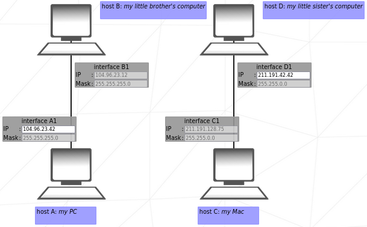
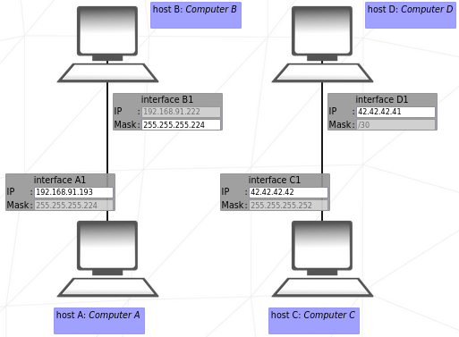
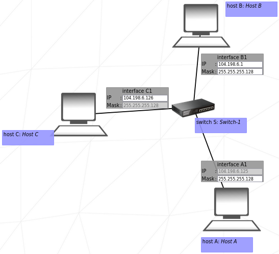
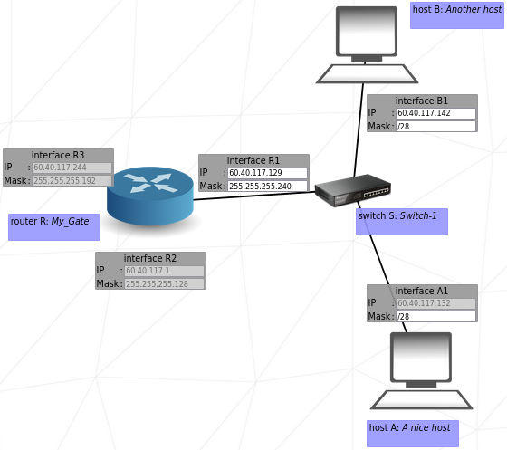
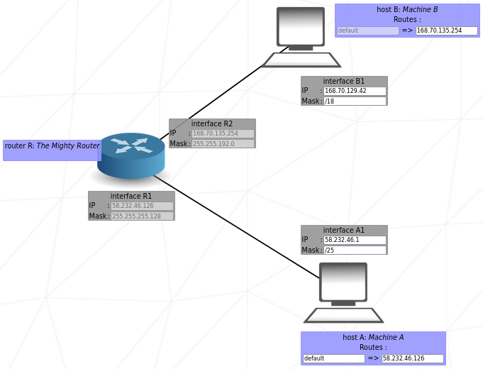
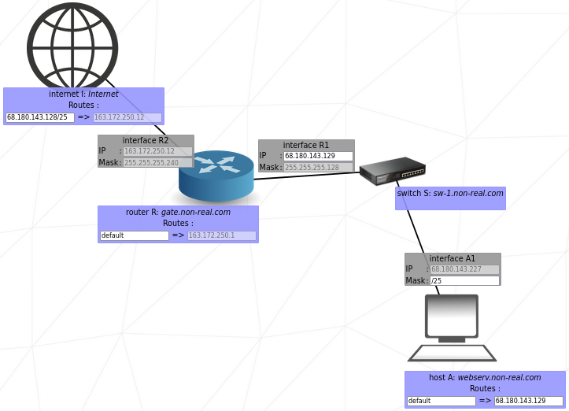
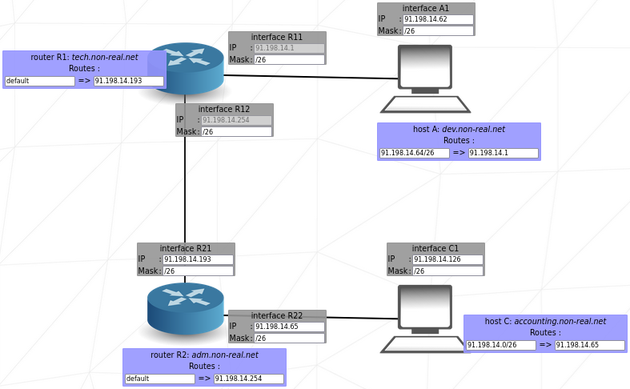
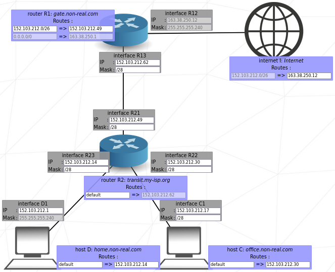
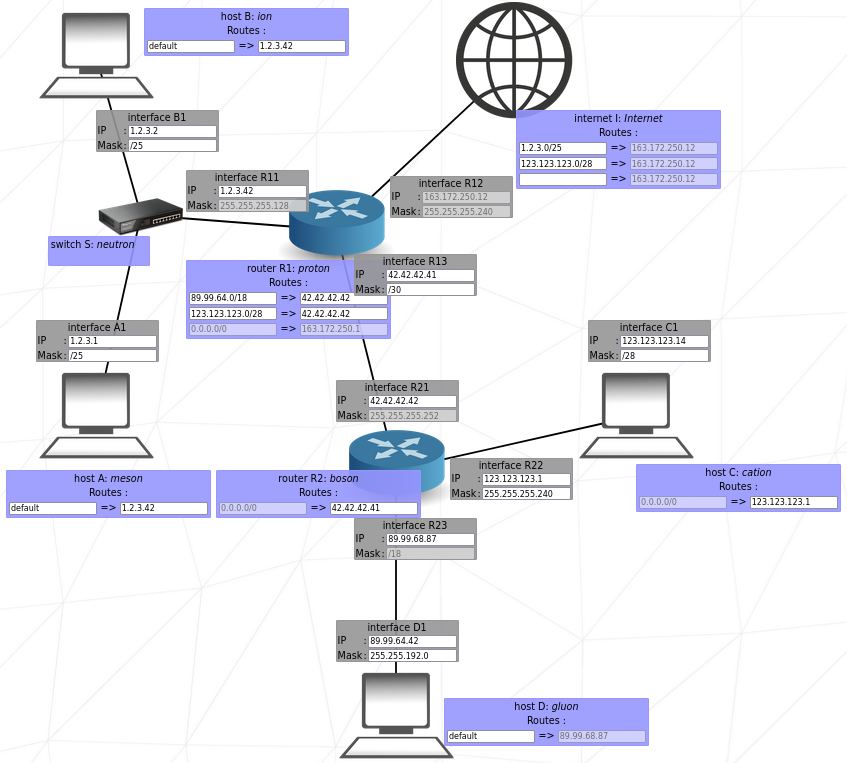
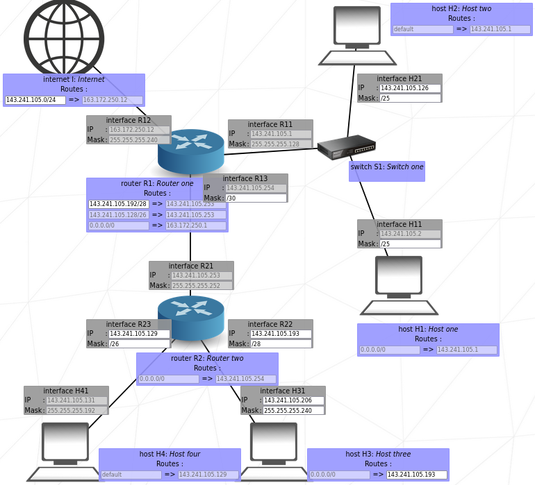

# 42-netpractice
This project is a simulation that challenges us to troubleshoot computer networks by configuring routers and hosts using IP addressing and routing principles. The goal is to understand how data travels through networks and how to ensure proper communication between different subnets and hosts.

## Key concepts
### Network
A **network** is a group of two or more devices (like computers, smartphones, servers, or routers) that are connected and able to communicate with each other to share data and resources.

The **Internet** is the largest network in the world. It's actually a network of networks, meaning it's made up of thousands of smaller networks all connected together. 
Each time you an e-mail is sent or a website is opened, data is sent through many routers and networks, all cooperating to deliver the request. The data hops between different routers and IP addresses, following paths based on routing rules, until it reaches its destination.

### IP Address & Subnet Mask
An **IP address** (Internet Protocol address) uniquely identifies a device on a network. It consists of two parts:
* The **network portion** identifies the specific network the device belongs to
* The **host portion** identifies a unique device within that network

To distinguish these portions, a **subnet mask** is used. The subnet mask uses a contiguous block of `1`s (from the left) to represent the network portion, followed by `0`s for the host portion.

**Devices must share the same network portion to communicate directly.**

For this project, we focus on IPv4, where both the IP address and the subnet mask are divided into four 8-bit blocks (called octets), each ranging from 0 to 255.

**CIDR (Classless Inter-Domain Routing)** notation is a compact way to represent an IP address and its associated subnet mask. It appends a slash (`/`) followed by a number indicating how many bits (from the left) belong to the network portion. 
The table below shows common CIDR prefixes, their corresponding subnet masks, and the implications for network size:

| **CIDR** | **Subnet Mask** | **# Network Bits** | **# Host Bits** | **# Hosts per Subnet** |
| -------- | --------------- | ------------------ | --------------- | ---------------------- |
| /8       | 255.0.0.0       | 8                  | 24              | 16,777,214             |
| /12      | 255.240.0.0     | 12                 | 20              | 1,048,574              |
| /16      | 255.255.0.0     | 16                 | 16              | 65,534                 |
| /24      | 255.255.255.0   | 24                 | 8               | 254                    |
| /25      | 255.255.255.128 | 25                 | 7               | 126                    |
| /30      | 255.255.255.252 | 30                 | 2               | 2                      |

Note: the number of usable hosts is always 2ⁿ - 2, because the first address is the network address and the last is the broadcast address.

Private IP addresses are used inside local networks (LANs) and are not directly routable from the public Internet. They are defined in these ranges, as per RFC 1918:
| **Class**        | **Private IP Range**          | **CIDR Notation**        | **Notes**                     |
|------------------|-------------------------------|--------------------------|-------------------------------|
| A                | 10.0.0.0 - 10.255.255.255     | 10.0.0.0/8               | Large private networks        |
| B                | 172.16.0.0 - 172.31.255.255   | 172.16.0.0/12            | Medium-sized private networks |
| C                | 192.168.0.0 - 192.168.255.255 | 192.168.0.0/16           | Home/small private networks   |

### Routing
Routers use **routing tables** to decide where to forward data packets. Each entry in the table defines a destination network, its netmask, and the "next hop" (usually another router's IP address or an outgoing interface) to reach that network.

## Exercises

  
Level 1

   
  

   

  
Level 2

   
  

   

  
Level 3

   
  

   

  
Level 4

   
  

   

  
Level 5

   
  

   

  
Level 6

   
  

   

  
Level 7

   
  

   

  
Level 8

   
  

   

  
Level 9

   
  

   

  
Level 10

   
  

   

